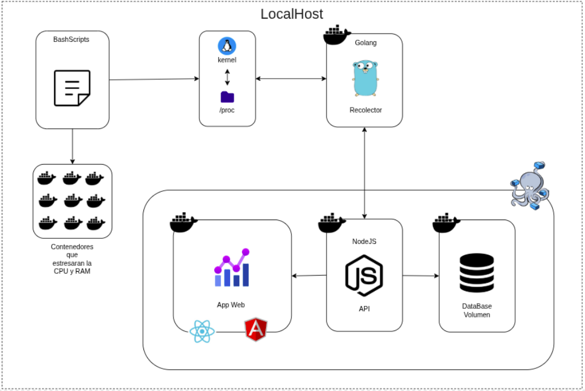
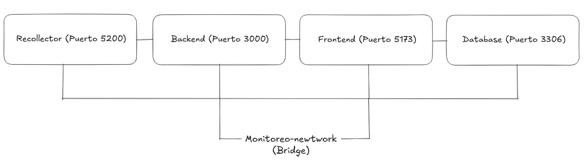

---
---
---

<p align="center"> 
<a href="https://git.io/typing-svg"></a>
</p>

---
---
---


  <h3 align="center"><strong>Universidad de San Carlos de Guatemala</strong></h3>
  <h3 align="center"><strong>Facultad de Ingeniería</strong></h3>
  <h3 align="center"><strong>Escuela de Ciencias y Sistemas</strong></h3>
  <h3 align="center"><strong>Lab. Sistemas Operativos 1</strong></h3>
  <h3 align="center"><strong>Sección: "A"</strong></h3>

---
---
---

<br>
<br>

# Manual Técnico Fase 1

<br>
<br>

| Nombre                           | Carnet      |
| -------------------------------- | ----------- |
| Josué Nabí Hurtarte Pinto        | `202202481` |

---

## <a name="indice">📅 INDICE

|     | Titulo                        | Link          |
| --- | ----------------------------- | ------------- |
| 1   | `Descripcion del proyecto`    | [IR](#desc)   |
| 2   | `Arquitectura del proyecto`   | [IR](#arq)   |
| 3   | `Modulo de la RAM`            | [IR](#ram)  |
| 4   | `Modulo del CPU`              | [IR](#cpu)  |
| 5   | `Recolector (Golang)`         | [IR](#rec)  |
| 6   | `Backend (Nodejs)`            | [IR](#back)  |
| 7   | `Base de datos (MySql)`       | [IR](#bd)  |
| 8   | `Frontend (React)`            | [IR](#front)  |
| 9   | `Docker-compose`              | [IR](#dc)  |
| 10  | `Scripts para automatización` | [IR](#bash)  |

## <a name="desc">1. Descripción del proyecto

### 📋 Objetivo General

El proyecto **Sistema de Monitoreo de Recursos** tiene como objetivo aplicar los conocimientos fundamentales de Sistemas Operativos mediante la implementación de un gestor de contenedores completo, que integra módulos de kernel, scripts de automatización, y tecnologías modernas de desarrollo para crear una solución robusta de monitoreo en tiempo real.

### 🎯 Propósito

Este sistema permite observar de manera detallada el uso de recursos del sistema (CPU, RAM) y la representación de contenedores a nivel de procesos de Linux, demostrando cómo los contenedores pueden ser creados, destruidos y conectados de manera flexible por otros servicios.

### 🔍 Funcionalidades Principales

- **Monitoreo en Tiempo Real**: Captura y visualiza métricas de CPU y RAM del sistema operativo
- **Módulos de Kernel Personalizados**: Implementación de módulos que acceden directamente a las estructuras del kernel Linux
- **Gestión de Contenedores**: Scripts para crear y administrar contenedores de estrés para testing
- **Arquitectura Distribuida**: Sistema modular con servicios independientes comunicándose entre sí
- **Persistencia de Datos**: Almacenamiento histórico de métricas para análisis posterior
- **Interfaz Web Responsiva**: Dashboard interactivo para visualización de datos

### 🏗️ Componentes del Sistema

El proyecto está compuesto por los siguientes módulos integrados:

1. **Módulos de Kernel (C)**: Recolección directa de métricas desde el espacio del kernel
2. **Recolector de Datos (Go)**: Servicio que obtiene datos de los módulos y los procesa
3. **API Backend (Node.js)**: Interfaz REST para manejo y almacenamiento de datos
4. **Base de Datos (MySQL)**: Persistencia de métricas históricas
5. **Frontend Web (React)**: Interfaz de usuario para visualización
6. **Orquestación (Docker Compose)**: Gestión y despliegue de todos los servicios
7. **Scripts de Automatización (Bash)**: Herramientas para instalación, testing y limpieza

### 🤖 Tecnologías Implementadas

- **Lenguajes**: C (kernel), Go (recolector), JavaScript (backend/frontend), Bash (scripts)
- **Frameworks**: Fiber (Go), Express (Node.js), React (frontend)
- **Infraestructura**: Docker, Docker Compose, MySQL
- **Sistema Operativo**: Linux (acceso directo al kernel)

### 🎓 Aplicación de Conceptos

Este proyecto demuestra la aplicación práctica de:

- **Programación de Kernel**: Desarrollo de módulos que interactúan directamente con el kernel Linux
- **Gestión de Procesos**: Comprensión de cómo los contenedores se representan como procesos
- **Comunicación Entre Procesos**: Implementación de canales y APIs para intercambio de datos
- **Concurrencia**: Uso de goroutines y manejo asíncrono en múltiples lenguajes
- **Contenerización**: Despliegue y orquestación de servicios distribuidos
- **Automatización**: Scripts para gestión completa del ciclo de vida del sistema


Este sistema representa una implementación completa que va desde el nivel más bajo del sistema operativo (kernel) hasta interfaces de usuario modernas, proporcionando una visión integral de cómo funcionan los sistemas de monitoreo en entornos de producción.

## <a name="arq">2. Arquitectura del proyecto



## <a name="ram">3. Módulo de la RAM

### 📋 Objetivo del módulo
Proporcionar información detallada sobre el uso de la memoria RAM del sistema en tiempo real, creando una interfaz en el sistema de archivos `/proc` que permite el acceso directo a las métricas de memoria desde el espacio de usuario.

### ⚙️ Funcionalidad del módulo

El módulo `ram_202202481` implementa las siguientes características:

- **Acceso directo al kernel**: Utiliza la función `si_meminfo()` para obtener información precisa sobre el estado actual de la memoria RAM
- **Cálculos automáticos**: Procesa los datos raw del kernel para calcular:
  - Total de memoria RAM disponible en el sistema
  - Memoria libre actualmente disponible
  - Memoria en uso (total - libre)
  - Porcentaje de utilización de memoria
- **Formato JSON**: Exporta toda la información en formato JSON estructurado para fácil consumo por aplicaciones
- **Interfaz `/proc`**: Crea el archivo `/proc/ram_202202481` para acceso desde espacio de usuario
- **Conversión de unidades**: Convierte automáticamente los valores del kernel a megabytes (MB) para mejor legibilidad

### 💻 código del módulo

```c
#include <linux/module.h>
#include <linux/kernel.h>
#include <linux/init.h>
#include <linux/proc_fs.h>
#include <asm/uaccess.h>
#include <linux/seq_file.h>
#include <linux/mm.h>
#include <linux/sysinfo.h>


MODULE_LICENSE("GPL");
MODULE_AUTHOR("Josue Nabi Hurtarte Pinto");
MODULE_DESCRIPTION("Sistemas Operativos 1 - Proyecto - Fase 1");
MODULE_VERSION("1.0");

/*
estructura del archivo /proc/ram
{
    "total": 0,
    "libre": 0,
    "uso": 0
    "porcentaje": 0
}
*/

// Funcion que se llama cuando se lee el archivo /proc/ram
static int mostrar_ram(struct seq_file * archivo, void *v) {
    struct sysinfo ram_info;
    long total, libre, uso, porcentaje;

    // Obtener la informacion de la memoria
    si_meminfo(&ram_info);

    // Calcular total, libre, uso y porcentaje y convertir a MB
    total = (ram_info.totalram * ram_info.mem_unit) / (1024 * 1024);
    libre = (ram_info.freeram * ram_info.mem_unit) / (1024 * 1024);
    uso = total - libre;
    porcentaje = (uso * 100) / total;


    // Generar en formato JSON
    seq_printf(archivo, "{\n");
    seq_printf(archivo, "\"total\": %ld,\n", total);
    seq_printf(archivo, "\"libre\": %ld,\n", libre);
    seq_printf(archivo, "\"uso\": %ld,\n", uso);
    seq_printf(archivo, "\"porcentaje\": %ld\n", porcentaje);
    seq_printf(archivo, "}\n");

    return 0;
}


// Cuando se le hace un cat al modulo
static int abrir_proc(struct inode *inode, struct file *file) {
    return single_open(file, mostrar_ram, NULL);
}

// Estructura de operaciones del archivo /proc/ram
static struct proc_ops ram_ops = {
    .proc_open = abrir_proc,
    .proc_read = seq_read
};

// Funcion de inicializacion del modulo
static int _insert(void) {
    proc_create("ram_202202481", 0, NULL, &ram_ops);
    printk(KERN_INFO "Modulo RAM cargado: /proc/ram creado\n");
    return 0;
}

// Funcion de limpieza del modulo
static void _delete(void) {
    remove_proc_entry("ram_202202481", NULL);
    printk(KERN_INFO "Modulo RAM descargado: /proc/ram eliminado\n");
}

module_init(_insert);
module_exit(_delete);
```

## <a name="cpu">4. Módulo del CPU

### 📋 Objetivo del módulo
Proporcionar información detallada sobre el uso del procesador (CPU) del sistema en tiempo real, calculando el porcentaje de utilización mediante el análisis de los procesos activos y creando una interfaz en el sistema de archivos `/proc` para acceso directo desde el espacio de usuario.

### ⚙️ Funcionalidad del módulo

El módulo `cpu_202202481` implementa las siguientes características:

- **Análisis de procesos**: Itera sobre todos los procesos activos del sistema utilizando `for_each_process()`
- **Cálculo de tiempo de CPU**: Suma el tiempo de usuario (`utime`) y sistema (`stime`) de cada proceso
- **Medición temporal**: Utiliza `ktime_get()` para obtener el tiempo total transcurrido del sistema
- **Cálculo de porcentaje**: Determina el porcentaje de utilización CPU basado en el tiempo usado vs tiempo total
- **Control de límites**: Garantiza que el porcentaje nunca supere el 100%
- **Formato JSON**: Exporta la información en formato JSON estructurado
- **Interfaz `/proc`**: Crea el archivo `/proc/cpu_202202481` para acceso desde espacio de usuario

### 🏗️ Algoritmo de cálculo

El módulo implementa un algoritmo personalizado para calcular el uso de CPU:

1. **Iteración de procesos**: Recorre todos los procesos del sistema usando la lista del kernel
2. **Acumulación de tiempo**: Suma `task->utime + task->stime` de cada proceso
3. **Tiempo del sistema**: Obtiene el tiempo total transcurrido desde el arranque
4. **Cálculo proporcional**: `porcentaje = (tiempo_usado * 100) / tiempo_total`
5. **Normalización**: Limita el resultado al rango 0-100%

### 💻 Código del módulo

```c
#include <linux/module.h>
#include <linux/kernel.h>
#include <linux/init.h>
#include <linux/proc_fs.h>
#include <linux/seq_file.h>
#include <linux/sched/signal.h>
#include <linux/sched.h>
#include <linux/timekeeping.h>
#include <linux/time.h>

MODULE_LICENSE("GPL");
MODULE_AUTHOR("Josue Nabi Hurtarte Pinto");
MODULE_DESCRIPTION("Sistemas Operativos 1 - Proyecto - Fase 1");
MODULE_VERSION("1.0");

// Función principal de cálculo del porcentaje de CPU
static int calcular_porcentaje_cpu(void) {
    struct task_struct *task;
    uint64_t total_time_cpu;
    uint64_t total_usage = 0;
    unsigned long porcentaje;

    // Sumar el tiempo de CPU de todos los procesos
    for_each_process(task) {
        uint64_t cpu_time_ns;
        cpu_time_ns = task->utime + task->stime;
        total_usage += cpu_time_ns;
    }

    // Obtener el tiempo total del sistema
    total_time_cpu = ktime_to_ns(ktime_get());

    // Calcular porcentaje
    if (total_time_cpu > 0) {
        porcentaje = (total_usage * 100) / total_time_cpu;
        // Asegurar que no supere 100%
        if (porcentaje > 100) {
            porcentaje = 100;
        }
    } else {
        porcentaje = 0;
    }

    return (int)porcentaje;
}

// Función que se llama cuando se lee el archivo /proc/cpu
static int mostrar_cpu(struct seq_file *archivo, void *v) {
    int porcentaje = calcular_porcentaje_cpu();
    
    // Generar salida en formato JSON
    seq_printf(archivo, "{\n");
    seq_printf(archivo, "    \"porcentaje\": %d\n", porcentaje);
    seq_printf(archivo, "}\n");
    
    return 0;
}

// Cuando se le hace un cat al módulo
static int abrir_proc(struct inode *inode, struct file *file) {
    return single_open(file, mostrar_cpu, NULL);
}

// Estructura de operaciones del archivo /proc/cpu
static const struct proc_ops cpu_ops = {
    .proc_open = abrir_proc,
    .proc_read = seq_read
};

// Función de inicialización del módulo
static int __init _insert(void) {
    proc_create("cpu_202202481", 0444, NULL, &cpu_ops);
    printk(KERN_INFO "Modulo CPU cargado: /proc/cpu_202202481 creado\n");
    return 0;
}

// Función de limpieza del módulo
static void __exit _delete(void) {
    remove_proc_entry("cpu_202202481", NULL);
    printk(KERN_INFO "Modulo CPU descargado: /proc/cpu_202202481 eliminado\n");
}

module_init(_insert);
module_exit(_delete);
```

## <a name="rec">5. Recolector (Golang)

### 📋 Objetivo del componente
El **Recolector** es el servicio intermediario desarrollado en Go que actúa como puente entre los módulos del kernel y el backend del sistema. Su función principal es obtener las métricas de CPU y RAM desde los archivos `/proc`, procesarlas y enviarlas de forma continua al backend para su almacenamiento y posterior visualización.

### ⚙️ Funcionalidad general

El recolector implementa una **arquitectura de canales y goroutines** que permite el procesamiento asíncrono y eficiente de las métricas del sistema:

#### **🔄 Recolección de datos:**
- **Lectura automática**: Ejecuta comandos para leer `/proc/cpu_202202481` y `/proc/ram_202202481` cada segundo
- **Parseo JSON**: Convierte la salida JSON de los módulos del kernel en estructuras de datos Go
- **Manejo de errores**: Gestiona fallos de lectura y continúa la operación sin interrupciones

#### **📡 Arquitectura con canales:**
- **Goroutines especializadas**: Tres hilos de ejecución independientes para CPU, RAM y procesamiento
- **Comunicación asíncrona**: Utiliza canales Go para transferir datos entre goroutines sin bloqueos
- **Sincronización de datos**: Solo envía información al backend cuando tiene datos tanto de CPU como de RAM

#### **🌐 Servicios web:**
- **API REST**: Servidor HTTP en puerto 5200 con endpoints para consultar métricas en tiempo real
- **CORS habilitado**: Permite conexiones desde el frontend web
- **Endpoints disponibles**: 
  - `/` - Estado del sistema
  - `/cpu` - Métricas actuales de CPU
  - `/ram` - Métricas actuales de RAM  
  - `/system` - Datos completos del sistema

#### **🔄 Envío al backend:**
- **Transmisión continua**: Envía las métricas procesadas al backend (Node.js) vía HTTP POST
- **Doble envío**: Separar las métricas de CPU y RAM en requests independientes
- **Logs informativos**: Muestra en consola el estado de cada operación de envío

### 🏗️ Flujo de trabajo

1. **Inicio del sistema**: Lanza tres goroutines concurrentes
2. **Recolección CPU**: Lee `/proc/cpu_202202481` cada segundo → envía a canal CPU
3. **Recolección RAM**: Lee `/proc/ram_202202481` cada segundo → envía a canal RAM  
4. **Procesamiento**: Recibe de ambos canales, sincroniza datos y envía al backend
5. **Servidor web**: Mantiene API REST activa para consultas directas

### 🎯 Ventajas de la implementación

- **Concurrencia**: Procesamiento paralelo sin bloqueos entre componentes
- **Robustez**: Continúa funcionando aunque fallen lecturas individuales
- **Flexibilidad**: Puede servir datos tanto al backend como directamente al frontend
- **Escalabilidad**: Arquitectura preparada para agregar más métricas fácilmente
- **Monitoreo**: Logs detallados para debugging y seguimiento de operaciones

### 🛠️ Tecnologías utilizadas

- **Lenguaje**: Go (Golang)
- **Framework web**: Fiber (alta performance)
- **Concurrencia**: Goroutines y canales nativos de Go
- **Comunicación**: HTTP REST APIs
- **Containerización**: Docker para despliegue

El recolector representa el núcleo de inteligencia del sistema, siendo responsable de mantener el flujo continuo de información entre el nivel del kernel y las capas superiores de la aplicación, garantizando que las métricas estén siempre actualizadas y disponibles para su visualización.

##  <a name="back">6. Backend (Node.js)

### 📋 Objetivo del componente
El **Backend** es el servicio central desarrollado en Node.js que actúa como el núcleo de procesamiento y almacenamiento del sistema de monitoreo. Su función principal es recibir las métricas procesadas desde el recolector Go, almacenarlas en la base de datos MySQL y proporcionar APIs REST para que el frontend pueda acceder a los datos históricos y en tiempo real.

### ⚙️ Funcionalidad general

El backend implementa una **arquitectura de API REST robusta** que maneja tanto la recepción de datos como la distribución de información:

#### **📥 Recepción de métricas:**
- **Endpoints especializados**: Rutas dedicadas `/cpu` y `/ram` para recibir datos del recolector Go
- **Procesamiento automático**: Convierte y valida datos JSON entrantes
- **Almacenamiento inmediato**: Inserta métricas en MySQL tan pronto como las recibe
- **Variables en memoria**: Mantiene cache de los datos más recientes para acceso rápido

#### **🗄️ Gestión de base de datos:**
- **Pool de conexiones**: Manejo eficiente de múltiples conexiones MySQL concurrentes
- **Reconexión automática**: Sistema de reintentos para garantizar disponibilidad
- **Consultas optimizadas**: Queries preparadas para inserción y recuperación de datos
- **Manejo de errores**: Logs detallados de errores de base de datos

#### **🌐 APIs para frontend:**
- **Métricas actuales**: Endpoint `/api/metrics` que devuelve los datos más recientes
- **Historial de CPU**: Endpoint `/api/cpu-history` con datos históricos paginados
- **Historial de RAM**: Endpoint `/api/ram-history` con métricas pasadas
- **CORS habilitado**: Permite conexiones desde cualquier origen para desarrollo

#### **🔄 Arquitectura de datos:**
- **Almacenamiento dual**: Datos en memoria para velocidad + base de datos para persistencia
- **Formato normalizado**: Convierte datos a tipos numéricos apropiados
- **Timestamps automáticos**: MySQL añade timestamps a cada registro automáticamente

### 🏗️ Flujo de trabajo

1. **Inicialización**: Establece pool de conexiones MySQL con reintentos automáticos
2. **Recepción continua**: Escucha requests POST del recolector Go cada segundo
3. **Procesamiento**: Valida, convierte y almacena datos de CPU y RAM por separado
4. **Cache en memoria**: Actualiza variables locales con los datos más recientes
5. **Servicio de APIs**: Responde consultas del frontend con datos históricos o actuales

### 🎯 Ventajas de la implementación

- **Alta disponibilidad**: Sistema de reintentos garantiza funcionamiento continuo
- **Performance optimizada**: Cache en memoria para consultas frecuentes
- **Escalabilidad**: Pool de conexiones maneja múltiples requests concurrentes
- **Separación de responsabilidades**: APIs especializadas para diferentes tipos de datos
- **Monitoring integrado**: Logs detallados de todas las operaciones

### 🛠️ Tecnologías utilizadas

- **Lenguaje**: JavaScript (Node.js)
- **Framework web**: Express.js
- **Base de datos**: MySQL2 con pool de conexiones
- **Middleware**: CORS para comunicación cross-origin
- **Containerización**: Docker para despliegue consistente

### 📊 Estructura de endpoints

- **POST /cpu**: Recibe métricas de CPU desde Go
- **POST /ram**: Recibe métricas de RAM desde Go  
- **GET /api/metrics**: Datos actuales para dashboard
- **GET /api/cpu-history**: Historial paginado de CPU
- **GET /api/ram-history**: Historial paginado de RAM
- **GET /**: Health check del servicio

El backend representa el corazón del sistema de persistencia, garantizando que todas las métricas recolectadas sean almacenadas de forma segura y estén disponibles para análisis histórico, mientras mantiene un rendimiento óptimo para consultas en tiempo real del dashboard web.

## <a name="bd">7. Base de datos (MySQL)

### 📋 Objetivo del componente
La **Base de Datos MySQL** actúa como el sistema de almacenamiento persistente del proyecto, encargada de mantener un historial completo de todas las métricas de CPU y RAM recolectadas por el sistema. Su función principal es garantizar la persistencia de datos y permitir consultas históricas para análisis de tendencias.

### ⚙️ Funcionalidad general

La base de datos implementa una **arquitectura simple pero eficiente** con dos tablas especializadas para el almacenamiento de métricas:

#### **🗄️ Almacenamiento estructurado:**
- **Tabla de CPU**: Almacena histórico completo de porcentajes de utilización de CPU
- **Tabla de RAM**: Mantiene registro detallado de métricas de memoria (total, libre, uso, porcentaje)
- **Timestamps automáticos**: Cada registro incluye marca temporal de creación y actualización
- **Índices optimizados**: Primary keys y timestamps para consultas rápidas

#### **🔧 Configuración automatizada:**
- **Inicialización automática**: Script DDL ejecutado al crear el contenedor
- **Usuario dedicado**: Credenciales específicas para la aplicación (`so1_user`)
- **Base de datos preparada**: Schema `Proyecto1_Fase1` creado automáticamente
- **Configuración MySQL 8.0**: Última versión estable con optimizaciones

### 🏗️ Estructura de tablas

#### **Tabla `cpu_info`:**
```sql
CREATE TABLE cpu_info (
  id INT AUTO_INCREMENT PRIMARY KEY,
  usage_percentage DECIMAL(5, 2) NOT NULL,
  created_at TIMESTAMP DEFAULT CURRENT_TIMESTAMP,
  updated_at TIMESTAMP DEFAULT CURRENT_TIMESTAMP ON UPDATE CURRENT_TIMESTAMP
);
```

#### **Tabla `memory_info`:**
```sql
CREATE TABLE memory_info (
  id INT AUTO_INCREMENT PRIMARY KEY,
  total_memory BIGINT NOT NULL,
  free_memory BIGINT NOT NULL,
  used_memory BIGINT NOT NULL,
  memory_usage_percentage DECIMAL(5, 2) NOT NULL,
  created_at TIMESTAMP DEFAULT CURRENT_TIMESTAMP,
  updated_at TIMESTAMP DEFAULT CURRENT_TIMESTAMP ON UPDATE CURRENT_TIMESTAMP
);
```

### 🛠️ Configuración del contenedor

#### Variables de entorno:
- `MYSQL_ROOT_PASSWORD=root`: Contraseña del administrador
- `MYSQL_DATABASE=Proyecto1_Fase1`: Base de datos del proyecto
- `MYSQL_USER=so1_user`: Usuario de la aplicación
- `MYSQL_PASSWORD=so1_password`: Contraseña de la aplicación

#### Inicialización

- Script DDL ejecutado automáticamente al arranque
- Puerto 3306 expuesto para conexiones 
- Volumen persistente para datos

La base de datos representa el fundamento de persistencia del sistema, garantizando que todas las métricas recolectadas estén disponibles para análisis histórico y proporcionando la base sólida sobre la cual funciona todo el sistema de monitoreo.


## <a name="front">8. Frontend (React)

### 📋 Objetivo del componente
El **Frontend** es la interfaz de usuario desarrollada en React con Vite que proporciona una experiencia visual moderna e interactiva para monitorear las métricas del sistema en tiempo real. Su función principal es consumir los datos del backend y presentarlos de manera intuitiva mediante gráficas animadas y estadísticas detalladas.

### ⚙️ Funcionalidad general

El frontend implementa un **dashboard interactivo** con actualizaciones en tiempo real y animaciones fluidas:

#### **📊 Visualización de datos:**
- **Gráficas tipo pie**: Representación visual clara del uso de CPU y RAM usando Chart.js
- **Actualización en tiempo real**: Polling cada segundo para obtener métricas actuales
- **Colores diferenciados**: Esquema de colores distintivo para cada tipo de métrica
- **Estadísticas detalladas**: Información numérica complementaria a las gráficas

#### **🎨 Experiencia de usuario:**
- **Animaciones fluidas**: Transiciones suaves powered by GSAP
- **Efectos hover**: Interacciones visuales al pasar el mouse sobre elementos
- **Alertas visuales**: Sistema de glow y efectos cuando las métricas superan 75%
- **Diseño responsivo**: Adaptable a diferentes tamaños de pantalla

#### **🔄 Gestión de estado:**
- **Hooks de React**: useState y useEffect para manejo de estado local
- **Referencias DOM**: useRef para animaciones directas con GSAP
- **Manejo de errores**: Fallback automático si falla la conexión al backend
- **Optimización de renders**: Actualizaciones controladas para mejor performance

### 🏗️ Arquitectura de componentes

#### **Componente principal (`App.jsx`):**
- Estructura base de la aplicación
- Importación y organización de componentes
- Configuración de estilos globales

#### **Header (`Header.jsx`):**
- Titulo de la aplicación
- Diseño del encabezado con branding

#### **Dashboard (`Dashboard.jsx`):**
- Núcleo de la visualización de métricas
- Gráficas interactivas de CPU y RAM
- Sistema de alertas y animaciones

#### **Utilidades (`generadorDatos.js`):**
- Funciones para consumir APIs del backend
- Manejo de errores y fallbacks
- Formateo de datos para visualización

### 🎯 Tecnologías y librerías

- **React**: Framework principal con hooks modernos
- **Vite**: Build tool ultra-rápido para desarrollo
- **Chart.js**: Librería de gráficas profesionales
- **GSAP**: Motor de animaciones de alta performance
- **CSS3**: Estilos modernos con flexbox y grid
- **Alpine Linux**: Contenedor optimizado para producción

### 📱 Características visuales

#### **Gráficas interactivas:**
- Pie charts con animaciones de rotación
- Tooltips informativos al hover
- Transiciones suaves entre estados
- Colores temáticos por tipo de métrica

#### **Sistema de alertas:**
- Glow effect cuando CPU/RAM > 75%
- Cambios de color automáticos
- Animaciones de pulso para llamar la atención
- Efectos de hover en contenedores

### 🔧 Flujo de datos

1. **Inicialización**: Animaciones de entrada al cargar la página
2. **Polling continuo**: Solicitud de métricas cada segundo al backend
3. **Actualización visual**: Gráficas se actualizan con nuevos datos
4. **Detección de alertas**: Sistema verifica umbrales críticos
5. **Renderizado optimizado**: Solo actualiza elementos que cambiaron

### 📦 Despliegue

El frontend se containeriza usando:
- **Base Alpine**: Imagen ligera de Node.js
- **Build optimizado**: npm run build para producción
- **Serve estático**: Servidor optimizado para archivos estáticos
- **Puerto 5173**: Acceso web estándar

El frontend representa la cara visible del sistema, transformando datos técnicos en una experiencia visual comprensible e interactiva, permitiendo a los usuarios monitorear el estado del sistema de manera intuitiva y en tiempo real.

## <a name="dc">9. Docker-compose

### 📋 Objetivo del componente
**Docker Compose** es el orquestador principal del sistema que coordina el despliegue y comunicación de todos los servicios del proyecto. Su función principal es gestionar el ciclo de vida completo de la aplicación, desde la inicialización de la base de datos hasta la exposición del frontend, garantizando que todos los servicios se comuniquen correctamente y mantengan su estado.

### ⚙️ Funcionalidad general

El docker-compose implementa una **arquitectura de microservicios containerizados** que maneja cuatro servicios principales con sus respectivas dependencias y configuraciones:

#### **🗄️ Servicio Database (MySQL):**
- **Imagen personalizada**: `josue013/sistema-monitoreo-database:latest` subida a Docker Hub
- **Inicialización automática**: Ejecuta scripts DDL al primer arranque
- **Persistencia garantizada**: Volumen `so1-db-vol` para mantener datos entre reinicios
- **Health checks**: Verificación de estado con `mysqladmin ping` antes de permitir conexiones
- **Configuración de red**: Expone puerto 3306 para conexiones internas

#### **🔧 Servicio Backend (Node.js):**
- **Imagen personalizada**: `josue013/sistema-monitoreo-backend:latest` desde Docker Hub
- **Dependencias controladas**: Espera a que la base de datos esté saludable antes de iniciar
- **Variables de entorno**: Configuración automática de conexión a MySQL
- **API REST**: Puerto 3000 expuesto para recibir datos del recolector
- **Reconexión automática**: Sistema de reintentos para conectar con la base de datos

#### **📊 Servicio Recollector (Go):**
- **Imagen personalizada**: `josue013/sistema-monitoreo-recollector:latest` de Docker Hub
- **Acceso privilegiado**: Modo `privileged: true` para acceder a módulos del kernel
- **Montaje de procesos**: Volumen `/proc:/proc` para leer métricas del sistema
- **Sincronización**: Depende del backend para envío de datos
- **API propia**: Puerto 5200 para consultas directas opcionales

#### **🎨 Servicio Frontend (React):**
- **Imagen personalizada**: `josue013/sistema-monitoreo-frontend:latest` desde Docker Hub
- **Aplicación estática**: Servida mediante servidor optimizado para producción
- **Interfaz web**: Puerto 5173 para acceso del usuario final
- **Dependencia lógica**: Espera al backend para consumir APIs

### 🌐 Arquitectura de red

#### **Red personalizada `monitoreo-network`:**
- **Driver bridge**: Permite comunicación interna entre contenedores
- **Resolución DNS**: Los servicios se comunican por nombre (database, backend, etc.)
- **Aislamiento**: Red privada separada del host y otras aplicaciones
- **Comunicación eficiente**: Tráfico interno sin pasar por interfaces externas

#### **Diagrama de comunicación:**


### 💾 Gestión de persistencia

#### **Volumen `so1-db-vol`:**
- **Persistencia de datos**: Mantiene información de MySQL entre reinicios
- **Montaje automático**: Docker gestiona la ubicación y acceso
- **Backup implícito**: Los datos sobreviven a recreación de contenedores
- **Performance optimizada**: Acceso directo sin overhead de bind mounts

### 🔄 Orden de inicialización

La orquestación sigue una secuencia controlada:

1. **Database**: Se inicia primero y ejecuta health checks
2. **Backend**: Espera a que database esté saludable, se conecta y prepara APIs
3. **Recollector**: Se inicia tras backend, comienza recolección de métricas
4. **Frontend**: Se lanza al final, consume APIs del backend

### 🎯 Características de producción

#### **Reinicio automático:**
- **`restart: unless-stopped`**: Todos los servicios se reinician automáticamente
- **Tolerancia a fallos**: El sistema se recupera de errores temporales
- **Mantenimiento**: Solo se detiene por acción explícita del administrador

#### **Health checks y dependencias:**
- **Verificación de MySQL**: `mysqladmin ping` confirma que la DB está lista
- **Dependencias ordenadas**: `depends_on` con `condition: service_healthy`
- **Inicialización robusta**: Evita errores de conexión por servicios no listos

### 🛠️ Imágenes de Docker Hub

Todas las imágenes están alojadas en Docker Hub bajo el usuario `josue013`:

- **Database**: `josue013/sistema-monitoreo-database:latest`
- **Backend**: `josue013/sistema-monitoreo-backend:latest`
- **Recollector**: `josue013/sistema-monitoreo-recollector:latest`
- **Frontend**: `josue013/sistema-monitoreo-frontend:latest`

### 🚀 Comandos de despliegue

```bash
# Desplegar todo el sistema
docker-compose up -d

# Verificar estado de servicios
docker-compose ps

# Ver logs de todos los servicios
docker-compose logs -f

# Detener el sistema (preserva datos)
docker-compose down

# Limpieza completa (elimina volúmenes)
docker-compose down -v
```

Docker Compose representa la columna vertebral de la infraestructura, proporcionando un despliegue reproducible, escalable y mantenible que garantiza la operación coordinada de todos los componentes del sistema de monitoreo.

## <a name="bash">10. Scripts para automatización

### 📋 Objetivo de los scripts
Los **Scripts de Automatización** son herramientas desarrolladas en Bash que facilitan la gestión completa del ciclo de vida del sistema de monitoreo. Su función principal es automatizar tareas repetitivas como instalación de módulos, despliegue de servicios, testing con contenedores de estrés y limpieza del sistema.

### ⚙️ Funcionalidad general

El conjunto de scripts implementa una **metodología de DevOps** que permite gestionar el proyecto de manera eficiente y reproducible:

---

## 🔧 Script 1: `1_stress_containers.sh`

### 📋 Propósito
Crear contenedores de estrés para probar el sistema de monitoreo bajo condiciones de alta carga de CPU y RAM.

### ⚙️ Funcionalidad
- **Verificaciones previas**: Comprueba que Docker esté corriendo
- **Gestión de imágenes**: Descarga `alexeiled/stress-ng` si no existe
- **Contenedores de CPU**: Crea 4 contenedores que estresan el procesador intensivamente
- **Contenedores de RAM**: Crea 5 contenedores que consumen 1GB de RAM cada uno
- **Contenedor mixto**: Un contenedor adicional que estresa CPU + RAM + I/O

### 🎯 Configuración de estrés
```bash
# CPU intensivo (4 contenedores)
--cpu 0 --cpu-method all --aggressive --timeout 0
--cpus="1.5"  # Límite de 1.5 núcleos por contenedor

# RAM intensivo (5 contenedores)
--vm 2 --vm-bytes 1000m --vm-keep --timeout 0
--memory="1200m"  # Límite de 1.2GB por contenedor
```

### 🛠️ Comandos de uso
```bash
# Ejecutar (no requiere sudo)
./scripts/1_stress_containers.sh

# Verificar contenedores creados
docker ps --filter "name=stress-"
```

## ⚙️ Script 2: `2_install_modules.sh`

### 📋 Propósito
Compilar e instalar los módulos del kernel de CPU y RAM en el sistema operativo.

### ⚙️ Funcionalidad

- **Verificación de permisos**: Solicita sudo si es necesario
- **Compilación automática**: Ejecuta make en cada directorio de módulos
- **Gestión de módulos**: Descarga módulos anteriores antes de instalar nuevos
- **Verificación de instalación**: Confirma que los módulos se cargaron correctamente
- **Limpieza automática**: Ejecuta make clean antes de compilar

### 🏗️ Proceso de instalación

```bash
# Para cada módulo (CPU y RAM):
1. cd al directorio del módulo
2. make clean  # Limpiar compilaciones anteriores
3. make all    # Compilar el módulo
4. rmmod (si ya existe)  # Descargar versión anterior
5. insmod módulo.ko      # Cargar nuevo módulo
6. Verificar en /proc/   # Confirmar creación de archivos
```

### 🛠️ Comandos de uso
```bash
# Ejecutar (requiere sudo)
sudo ./scripts/2_install_modules.sh

# Verificar módulos instalados
lsmod | grep "202202481"
ls -la /proc/*202202481*
```

### 🧹 Script 3: `3_cleanup_all.sh`

### 📋 Propósito
Limpiar completamente el sistema eliminando módulos, contenedores y archivos temporales, pero preservando los datos de la base de datos.

### ⚙️ Funcionalidad
- **Descarga de módulos**: Elimina los módulos del kernel de CPU y RAM
- **Eliminación de contenedores**: Borra todos los contenedores de estrés creados
- **Servicios Docker**: Detiene docker-compose y elimina servicios
- **Archivos compilados**: Ejecuta make clean en los módulos
- **Preservación de datos**: No elimina el volumen de la base de datos para mantener métricas históricas

### 🔧 Comandos de uso
```bash
# Ejecutar (requiere sudo para módulos)
sudo ./scripts/3_cleanup_all.sh

# Verificar limpieza
docker ps -a
lsmod | grep "202202481"
```

## 🚀 Script 4: `4_deploy_app.sh`

### 📋 Propósito
Desplegar toda la aplicación usando Docker Compose con las imágenes de Docker Hub.

### ⚙️ Funcionalidad
- **Verificaciones previas**: Comprueba que Docker y Docker Compose estén instalados
- **Limpieza previa**: Elimina servicios y contenedores anteriores
- **Descarga de imágenes**: Obtiene las últimas imágenes del proyecto desde Docker Hub
- **Despliegue completo**: Levanta todos los servicios definidos en `docker-compose.yml`
- **Información util**: Muestra URLs de acceso y estado de los servicios

### 🌐 Servicios desplegados

| Servicio    | URL                     |
| ----------- | ----------------------- |
| Frontend    | `http://localhost:5173` |
| Backend     | `http://localhost:3000` |
| Recollector | `http://localhost:5200` |
| Database    | `localhost:3306`        |


### 🛠️ Comandos de uso
```bash
# Ejecutar (no requiere sudo)
./scripts/4_deploy_app.sh

# Verificar despliegue
docker-compose ps
```

## 👨‍💻 Autor

[@Josue013](https://www.github.com/Josue013)
