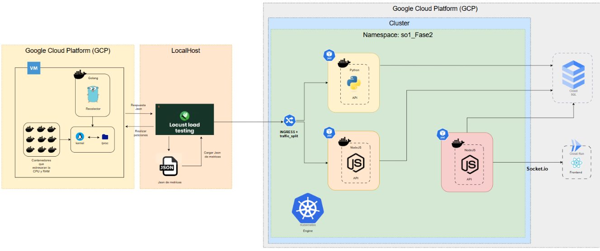
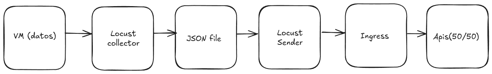

---
---
---

<p align="center"> 
<a href="https://git.io/typing-svg"></a>
</p>

---
---
---


  <h3 align="center"><strong>Universidad de San Carlos de Guatemala</strong></h3>
  <h3 align="center"><strong>Facultad de Ingeniería</strong></h3>
  <h3 align="center"><strong>Escuela de Ciencias y Sistemas</strong></h3>
  <h3 align="center"><strong>Lab. Sistemas Operativos 1</strong></h3>
  <h3 align="center"><strong>Sección: "A"</strong></h3>

---
---
---

<br>
<br>

# Manual Técnico Fase 2

<br>
<br>

| Nombre                           | Carnet      |
| -------------------------------- | ----------- |
| Josué Nabí Hurtarte Pinto        | `202202481` |

---

## <a name="indice">📅 INDICE

|     | Titulo                      | Link         |
| --- | --------------------------- | ------------ |
| 1   | `Descripcion del proyecto`  | [IR](#desc)  |
| 2   | `Arquitectura del proyecto` | [IR](#arq)   |
| 3   | `Modulo de procesos`        | [IR](#pro)   |
| 4   | `Locust`                    | [IR](#loc)   |
| 5   | `Kubernetes`                | [IR](#kub)   |
| 6   | `Rutas`                     | [IR](#ru)    |
| 7   | `Socket.io`                 | [IR](#sktio) |
| 8   | `Cloud Sql`                 | [IR](#csql)  |
| 9   | `Cloud Run`                 | [IR](#crun)  |

---

## <a name="desc">1. Descripción del proyecto

### 📋 Objetivo General

La **Fase 2** del proyecto Sistema de Monitoreo de Recursos evoluciona la arquitectura hacia una **solución cloud-native completa**, implementando conceptos avanzados de DevOps, orquestación de contenedores, microservicios y monitoreo en tiempo real. El objetivo es crear una infraestructura escalable y robusta utilizando Google Cloud Platform y tecnologías modernas de contenedores.

### 🎯 Evolución respecto a Fase 1

| **Aspecto**              | **Fase 1**                    | **Fase 2**                           |
|--------------------------|-------------------------------|--------------------------------------|
| **Infraestructura**     | Docker Compose local          | Google Kubernetes Engine (GKE)      |
| **Base de Datos**       | MySQL en contenedor           | Cloud SQL (MySQL administrado)      |
| **Escalabilidad**       | Monolítico                     | Microservicios distribuidos         |
| **Balanceador**         | Sin balanceador                | NGINX + Traffic Split 50/50         |
| **Tiempo Real**         | Polling cada segundo           | WebSockets con Socket.io            |
| **Frontend**            | React básico                   | React + Cloud Run + Tiempo Real     |
| **CI/CD**               | Manual                         | GitHub Actions automatizado         |
| **Monitoreo**           | Logs básicos                   | Observabilidad completa              |

### 🚀 Funcionalidades Nuevas

#### **🌐 Infraestructura Cloud-Native:**
- **Google Kubernetes Engine**: Orquestación automática de contenedores
- **Cloud SQL**: Base de datos MySQL totalmente administrada
- **Cloud Run**: Despliegue serverless para frontend
- **Load Balancer**: Distribución inteligente de tráfico

#### **⚖️ Balanceador de Carga Avanzado:**
- **Traffic Split 50/50**: Distribución equitativa entre APIs de Python y Node.js
- **NGINX Ingress**: Configuración de rutas y balanceo automático
- **Health Checks**: Verificación automática de estado de servicios
- **Failover**: Redirección automática en caso de fallos

#### **📡 Tiempo Real con WebSockets:**
- **Socket.io**: Comunicación bidireccional en tiempo real
- **API Node.js dedicada**: Servicio especializado para WebSockets
- **Frontend reactivo**: Actualizaciones instantáneas sin polling
- **Escalabilidad horizontal**: Múltiples instancias de APIs

#### **📊 Observabilidad Completa:**
- **Logs centralizados**: Agregación de logs de todos los servicios
- **Métricas de sistema**: CPU, RAM, procesos en tiempo real
- **Health endpoints**: Monitoreo de estado de cada microservicio
- **Alertas automáticas**: Notificaciones en caso de fallos

### 🏗️ Arquitectura de Microservicios

La Fase 2 implementa una **arquitectura de microservicios distribuida**:

1. **VM Linux**: Sistema base con módulos de kernel para recolección de métricas
2. **Cluster GKE**: Orquestación de 4 microservicios independientes
3. **Load Balancer**: NGINX que distribuye carga entre APIs
4. **APIs duales**: Python (FastAPI) + Node.js (Express) con traffic split
5. **Tiempo Real**: API Node.js especializada con Socket.io
6. **Frontend**: React en Cloud Run con WebSockets
7. **Base de Datos**: Cloud SQL MySQL con alta disponibilidad

### 🎓 Conceptos Implementados

- **Orquestación de Contenedores**: Kubernetes en producción
- **Microservicios**: Servicios independientes y escalables
- **Load Balancing**: Distribución inteligente de carga
- **Tiempo Real**: WebSockets para comunicación instantánea
- **Cloud Computing**: Servicios administrados de Google Cloud
- **Observabilidad**: Monitoreo y logging distribuido

---

## <a name="arq">2. Arquitectura del proyecto



### 🔧 Componentes Principales

| **Componente**     | **Tecnología**      | **Función**                             |
| ------------------ | ------------------- | --------------------------------------- |
| Maquina Virtual    | Ubuntu 22.04        | Sistema con módulos kernel              |
| Locust             | Python + Locust     | Generación de carga y pruebas de estrés |
| Kubernetes Cluster | GKE                 | Orquestación de microservicios          |
| Load Balancer      | NGINX Ingress       | Traffic split y balanceo                |
| Python API         | Flask               | Procesamiento de métricas               |
| Node.js API        | Express             | API REST alternativa                    |
| Realtime API       | Node.js + Socket.io | WebSockets en tiempo real               |
| Frontend           | React + Cloud Run   | Interfaz de usuario                     |
| Database           | Cloud SQL MySQL     | Almacenamiento persistente              |

---

## <a name="pro">3. Módulo de procesos

### 📋 Objetivo del módulo
Proporcionar información detallada sobre los procesos del sistema operativo en tiempo real, incluyendo conteos por estado (corriendo, durmiendo, zombies, parados) y total de procesos. El módulo crea una interfaz en el sistema de archivos `/proc` que permite el acceso directo a las métricas de procesos desde el espacio de usuario.

### ⚙️ Funcionalidad del módulo

El módulo `procesos_202202481` implementa las siguientes características:

- **Iteración completa de procesos**: Utiliza `for_each_process(task)` para recorrer todos los procesos del sistema
- **Análisis de estados**: Examina el campo `task->__state` de cada proceso para clasificarlos por estado
- **Detección de zombies**: Verifica el campo `task->exit_state` para identificar procesos zombie
- **Conteo automático**: Calcula automáticamente:
  - Total de procesos en el sistema
  - Procesos en estado corriendo (`TASK_RUNNING`)
  - Procesos durmiendo (`TASK_INTERRUPTIBLE` | `TASK_UNINTERRUPTIBLE`)
  - Procesos parados (`__TASK_STOPPED` | `__TASK_TRACED`)
  - Procesos zombie (`EXIT_ZOMBIE`)
- **Formato JSON**: Exporta toda la información en formato JSON estructurado para fácil consumo por aplicaciones
- **Interfaz `/proc`**: Crea el archivo `/proc/procesos_202202481` para acceso desde espacio de usuario

### 🏗️ Algoritmo de clasificación

El módulo implementa un algoritmo de clasificación basado en las constantes del kernel:

1. **Iteración de procesos**: Recorre la lista de procesos del kernel usando `for_each_process()`
2. **Análisis de estado principal**: Examina `task->__state` para determinar el estado actual
3. **Clasificación por estado**:
   - `TASK_RUNNING (0x00000000)`: Proceso ejecutándose o listo para ejecutar
   - `TASK_INTERRUPTIBLE (0x00000001)`: Proceso durmiendo, puede ser interrumpido por señales
   - `TASK_UNINTERRUPTIBLE (0x00000002)`: Proceso durmiendo, no puede ser interrumpido
   - `__TASK_STOPPED (0x00000004)`: Proceso parado por señal
   - `__TASK_TRACED (0x00000008)`: Proceso siendo rastreado por debugger
4. **Detección de zombies**: Verifica `task->exit_state & EXIT_ZOMBIE` independientemente del estado principal
5. **Conteo incremental**: Mantiene contadores separados para cada categoría

### 📊 Estados de procesos monitoreados

| **Estado**              | **Constante del Kernel**    | **Descripción**                           |
|-------------------------|----------------------------|-------------------------------------------|
| **Corriendo**           | `TASK_RUNNING`             | Proceso ejecutándose o en cola de CPU    |
| **Durmiendo**           | `TASK_INTERRUPTIBLE`       | Esperando evento, puede ser interrumpido |
| **Durmiendo profundo**  | `TASK_UNINTERRUPTIBLE`     | Esperando I/O, no puede ser interrumpido |
| **Parado**              | `__TASK_STOPPED`           | Detenido por señal (SIGSTOP, SIGTSTP)    |
| **Rastreado**           | `__TASK_TRACED`            | Bajo control de debugger (gdb, strace)   |
| **Zombie**              | `EXIT_ZOMBIE`              | Proceso terminado esperando recolección   |

### 💻 Código del módulo

```c
#include <linux/module.h>
#include <linux/kernel.h>
#include <linux/init.h>
#include <linux/proc_fs.h>
#include <linux/seq_file.h>
#include <linux/sched.h>
#include <linux/sched/signal.h>

MODULE_LICENSE("GPL");
MODULE_AUTHOR("Josue Nabi Hurtarte Pinto");
MODULE_DESCRIPTION("Sistemas Operativos 1 - Proyecto - Fase 2");
MODULE_VERSION("1.0");

/*
Estructura del archivo /proc/procesos_202202481
{
  "procesos_corriendo": 123,
  "total_procesos": 233,
  "procesos_durmiendo": 65,
  "procesos_zombies": 65,
  "procesos_parados": 65
}
*/

// Estados de procesos del kernel
#define TASK_RUNNING            0x00000000
#define TASK_INTERRUPTIBLE      0x00000001
#define TASK_UNINTERRUPTIBLE    0x00000002
#define __TASK_STOPPED          0x00000004
#define __TASK_TRACED           0x00000008
// Estados de salida
#define EXIT_DEAD               0x00000010
#define EXIT_ZOMBIE             0x00000020

// Función que cuenta los procesos por estado
static void contar_procesos(int *corriendo, int *total, int *durmiendo, int *zombies, int *parados) {
    struct task_struct *task;
    
    // Inicializar contadores
    *corriendo = 0;
    *total = 0;
    *durmiendo = 0;
    *zombies = 0;
    *parados = 0;

    // Iterar sobre todos los procesos del sistema
    for_each_process(task) {
        (*total)++;
        
        // Verificar el estado del proceso
        if (task->__state == TASK_RUNNING) {
            (*corriendo)++;
        }
        else if (task->__state & (TASK_INTERRUPTIBLE | TASK_UNINTERRUPTIBLE)) {
            (*durmiendo)++;
        }
        else if (task->__state & (__TASK_STOPPED | __TASK_TRACED)) {
            (*parados)++;
        }
        
        // Verificar si es zombie
        if (task->exit_state & EXIT_ZOMBIE) {
            (*zombies)++;
        }
    }
}

// Función que se llama cuando se lee el archivo /proc/procesos_202202481
static int mostrar_procesos(struct seq_file *archivo, void *v) {
    int procesos_corriendo, total_procesos, procesos_durmiendo, procesos_zombies, procesos_parados;
    
    // Obtener conteos de procesos
    contar_procesos(&procesos_corriendo, &total_procesos, &procesos_durmiendo, &procesos_zombies, &procesos_parados);
    
    // Generar salida en formato JSON
    seq_printf(archivo, "{\n");
    seq_printf(archivo, "  \"procesos_corriendo\": %d,\n", procesos_corriendo);
    seq_printf(archivo, "  \"total_procesos\": %d,\n", total_procesos);
    seq_printf(archivo, "  \"procesos_durmiendo\": %d,\n", procesos_durmiendo);
    seq_printf(archivo, "  \"procesos_zombies\": %d,\n", procesos_zombies);
    seq_printf(archivo, "  \"procesos_parados\": %d\n", procesos_parados);
    seq_printf(archivo, "}\n");
    
    return 0;
}

// Cuando se le hace un cat al módulo
static int abrir_proc(struct inode *inode, struct file *file) {
    return single_open(file, mostrar_procesos, NULL);
}

// Estructura de operaciones del archivo /proc/procesos_202202481
static const struct proc_ops procesos_ops = {
    .proc_open = abrir_proc,
    .proc_read = seq_read
};

// Función de inicialización del módulo
static int __init _insert(void) {
    proc_create("procesos_202202481", 0444, NULL, &procesos_ops);
    printk(KERN_INFO "Modulo Procesos cargado: /proc/procesos_202202481 creado\n");
    return 0;
}

// Función de limpieza del módulo
static void __exit _delete(void) {
    remove_proc_entry("procesos_202202481", NULL);
    printk(KERN_INFO "Modulo Procesos descargado: /proc/procesos_202202481 eliminado\n");
}

module_init(_insert);
module_exit(_delete);
```

### Compilación e instalación del módulo

makefile:

```makefile
obj-m += procesos_202202481.o

all:
    make -C /lib/modules/$(shell uname -r)/build M=$(PWD) modules

clean:
    make -C /lib/modules/$(shell uname -r)/build M=$(PWD) clean
```

Compilación:

```bash
# Navegar al directorio del módulo
cd Kernel/process/

# Limpiar compilaciones anteriores
make clean

# Compilar el módulo
make all
```

Instalacion:
```bash
# Cargar el módulo (requiere sudo)
sudo insmod procesos_202202481.ko

# Verificar que se cargó correctamente
lsmod | grep procesos_202202481

# Verificar que el archivo /proc fue creado
ls -la /proc/procesos_202202481
```

## <a name="loc">4. Locust 

### 📋 Objetivo de Locust en Fase 2

Locust en la Fase 2 implementa un **sistema de recolección y distribución de carga en dos etapas**, diseñado para probar tanto la capacidad de la VM como el traffic splitting del ingress. El objetivo es simular un flujo real de datos desde una fuente (VM) hacia un sistema distribuido (Kubernetes cluster).

### 🚀 Flujo de trabajo de Locust 



### 📄 Archivos de Locust

#### **1. traffic_collector.py - Recolector de datos de VM**

##### **🎯 Objetivo:**
Simular múltiples usuarios recolectando datos de la máquina virtual para generar carga y obtener métricas reales del sistema bajo estrés. Este archivo actúa como **cliente de la VM** y **generador de datos**.

##### **⚙️ Funcionalidades principales:**

- **Generación de carga**: Simula 300+ usuarios concurrentes accediendo a la VM
- **Recolección automática**: Obtiene métricas de CPU, RAM y procesos en tiempo real
- **Almacenamiento estructurado**: Guarda datos en formato JSON para posterior procesamiento
- **Control de calidad**: Valida que los datos obtenidos sean completos y útiles
- **Límite inteligente**: Se detiene automáticamente al alcanzar el objetivo de registros

##### **🔧 Configuración recomendada:**
```bash
locust -f traffic_collector.py --host=http://VM_IP:5200 \
       --users 300 --spawn-rate 1 --run-time 180s --headless
```

#### **2. traffic_splitter.py - Enviador de trafico**

##### **🎯 Objetivo:**

Probar el balanceador de carga NGINX enviando los datos recolectado al ingress del cluster kubernetes. Este archivo actua como cliente del cluster y validador del traffic splitting.  

##### **⚙️ Funcionalidades principales:**

- **Datos únicos**: Envía datos únicos para evitar duplicados en el sistema
- **Monitoreo de distribución**: Rastrea que API procesó cada peticion.
- **Estadisticas en tiempo real**: Muestra progreso y distribucion cada 50 registros.

##### **🔧 Configuración recomendada:**
```bash
locust -f send_to_ingress.py --host=http://INGRESS_IP \
       --users 150 --spawn-rate 1 --run-time 180s --headless
```

## <a name="kub">5. Kubernetes

### 📋 Objetivo de Kubernetes en Fase 2

Google Kubernetes Engine (GKE) actúa como el **núcleo de orquestación** de la infraestructura cloud-native, administrando automáticamente el despliegue, escalado y balanceo de carga de los microservicios. El cluster implementa una **arquitectura de servicios distribuidos** con alta disponibilidad y escalabilidad horizontal.

### 🏗️ Arquitectura del Cluster GKE

```
Google Kubernetes Engine (GKE)
├── Namespace: sopes1-fase2
├── Deployment: python-api-deployment (1 replica)
├── Deployment: nodejs-api-deployment (1 replica)  
├── Deployment: nodejs-realtime-api-deployment (1 replica)
├── Deployment: metrics-proxy (NGINX - 1 replica)
├── Services: ClusterIP + NodePort
└── Ingress: External Load Balancer
```

### 🏛️ Namespace: sopes1-fase2

#### **🎯 Propósito:**
Crear un **entorno aislado** dentro del cluster para todos los recursos del proyecto, proporcionando separación lógica y control de acceso granular.

#### **📋 Recursos contenidos:**
- **4 Deployments**: APIs Python, Node.js, Socket.io y NGINX proxy
- **4 Services**: Servicios internos para comunicación entre pods
- **1 Ingress**: Load balancer externo para acceso público
- **1 ConfigMap**: Configuración de NGINX para traffic splitting

#### **🔧 Ventajas del namespace:**
- **Aislamiento**: Separación completa de otros proyectos
- **Gestión simplificada**: Operaciones agrupadas por namespace
- **Control de recursos**: Límites de CPU/RAM por namespace
- **Seguridad**: Políticas de red específicas

### 🐳 Deployments (Pods)

#### **1. python-api-deployment**

##### **🎯 Función:**
Despliegue de la **API Python Flask** para procesamiento de métricas y almacenamiento en Cloud SQL.

##### **⚙️ Configuración clave:**
- **Imagen**: `josue013/sopes1-python-api:latest`
- **Puerto interno**: 5000
- **Réplicas**: 1 (escalable horizontalmente)
- **Recursos**: 256Mi RAM, 0.25 CPU (límites: 512Mi, 0.5 CPU)
- **Health checks**: Liveness + Readiness probes en `/health`

##### **🔗 Variables de entorno:**
- Conexión directa a Cloud SQL MySQL
- Credenciales de base de datos seguras
- Configuración de puerto personalizable

---

#### **2. nodejs-api-deployment**

##### **🎯 Función:**
Despliegue de la **API Node.js Express** como alternativa ligera para procesamiento rápido de métricas y balanceo de carga con Python.

##### **⚙️ Configuración clave:**
- **Imagen**: `josue013/sopes1-nodejs-api:latest`
- **Puerto interno**: 3000
- **Réplicas**: 1 (escalable horizontalmente)
- **Recursos**: 256Mi RAM, 0.25 CPU (límites: 512Mi, 0.5 CPU)
- **Health checks**: Liveness + Readiness probes en `/health`

##### **🔗 Variables de entorno:**
- Misma base de datos que Python API (Cloud SQL)
- Configuración idéntica para traffic splitting
- Puerto configurable via variable de entorno

---

#### **3. nodejs-realtime-api-deployment**

##### **🎯 Función:**
Despliegue **especializado en tiempo real** con Socket.io para comunicación bidireccional WebSocket con el frontend.

##### **⚙️ Configuración clave:**
- **Imagen**: `josue013/sopes1-nodejs-realtime-api:latest`
- **Puerto interno**: 4000
- **Réplicas**: 1 (optimizado para WebSocket persistence)
- **Recursos**: 256Mi RAM, 0.25 CPU (límites: 512Mi, 0.5 CPU)
- **Health checks**: Verificación de Socket.io endpoint

##### **🔗 Características especiales:**
- **WebSocket support**: Configurado para Socket.io
- **CORS habilitado**: Para frontend en Cloud Run
- **Conexión persistente**: Mantiene estado de conexiones activas

---

#### **4. metrics-proxy (NGINX)**

##### **🎯 Función:**
**Load balancer interno** que implementa traffic splitting 50/50 entre las APIs Python y Node.js, actuando como punto de entrada único.

##### **⚙️ Configuración clave:**
- **Imagen**: `nginx:alpine`
- **Puerto interno**: 80
- **Réplicas**: 1 (punto único de entrada)
- **ConfigMap**: Configuración NGINX personalizada
- **Upstream**: Round-robin entre python-api y nodejs-api

##### **🔗 Rutas configuradas:**
- `/health` → Python API (health check principal)
- `/metrics` → Round-robin 50/50 (traffic splitting)
- `/debug` → Información del balanceador
- `/` → Status página del proxy

### 🌐 Services (Comunicación Interna)

#### **Tipos de Services implementados:**

##### **1. ClusterIP Services (Comunicación Interna)**

###### **python-api-service:**
- **Tipo**: ClusterIP (interno al cluster)
- **Puerto**: 80 → 5000 (pod)
- **Función**: Exponer Python API internamente
- **Acceso**: Solo desde otros pods del cluster

###### **nodejs-api-service:**
- **Tipo**: ClusterIP (interno al cluster)
- **Puerto**: 80 → 3000 (pod)
- **Función**: Exponer Node.js API internamente
- **Acceso**: Solo desde otros pods del cluster

###### **metrics-proxy-service:**
- **Tipo**: ClusterIP (interno al cluster)
- **Puerto**: 80 → 80 (nginx pod)
- **Función**: Exponer NGINX proxy internamente
- **Acceso**: Recibe tráfico del Ingress

##### **2. NodePort Service (Acceso Externo)**

###### **nodejs-realtime-api-service:**
- **Tipo**: NodePort (acceso externo directo)
- **Puerto**: 80 → 4000 (pod)
- **NodePort**: 30080 (puerto fijo en nodos)
- **Función**: Acceso directo para WebSockets
- **Motivo**: Bypass del Ingress para Socket.io

### 📊 Flujo de comunicación

#### **Tráfico interno (APIs REST):**
```
Ingress → metrics-proxy-service → NGINX Pod
   ↓
NGINX (Round-robin) 
   ├── python-api-service → Python Pod
   └── nodejs-api-service → Node.js Pod
```

#### **Tráfico WebSocket (Tiempo Real):**
```
Frontend → NodeIP:30080 → nodejs-realtime-api-service → Socket.io Pod
```

### 🔧 Comandos de despliegue

#### **Creación del cluster:**
```bash
# Crear cluster GKE optimizado
gcloud container clusters create sopes1-cluster \
  --zone=us-central1-a \
  --num-nodes=1 \
  --machine-type=n1-standard-2 \
  --enable-autoscaling \
  --max-nodes=3
```

#### **Configuración del namespace:**
```bash
# Crear namespace dedicado
kubectl create namespace sopes1-fase2

# Establecer como namespace por defecto
kubectl config set-context --current --namespace=sopes1-fase2
```

#### **Despliegue de servicios:**
```bash
# Desplegar Python API
kubectl apply -f python.yaml

# Desplegar Node.js API
kubectl apply -f nodejs1.yaml

# Desplegar Socket.io API
kubectl apply -f nodejs2.yaml

# Desplegar NGINX Proxy + Ingress
kubectl apply -f ingress.yaml
```

#### **Verificación del despliegue:**
```bash
# Verificar pods
kubectl get pods -n sopes1-fase2

# Verificar services
kubectl get services -n sopes1-fase2

# Verificar logs
kubectl logs deployment/python-api-deployment -n sopes1-fase2
```

### 🎯 Ventajas de la implementación en Kubernetes

- **Orquestación automática**: Gestión de ciclo de vida de contenedores
- **Service discovery**: Comunicación automática entre servicios
- **Load balancing**: Distribución inteligente de carga
- **Health checks**: Verificación automática de estado de servicios
- **Rolling updates**: Actualizaciones sin downtime
- **Resource management**: Control granular de CPU y memoria
- **Namespace isolation**: Separación lógica de recursos
- **Horizontal scaling**: Escalado automático bajo demanda

### 🔍 Monitoreo y debugging

#### **Estado del cluster:**
```bash
# Estado general
kubectl get all -n sopes1-fase2

# Descripción detallada de pods
kubectl describe pod <pod-name> -n sopes1-fase2

# Logs en tiempo real
kubectl logs -f deployment/python-api-deployment -n sopes1-fase2
```

#### **Métricas de recursos:**
```bash
# Uso de recursos por pod
kubectl top pods -n sopes1-fase2

# Uso de recursos por nodo
kubectl top nodes
```

La implementación de Kubernetes en Fase 2 transforma la arquitectura de un sistema monolítico hacia una **solución cloud-native distribuida**, proporcionando la base sólida para escalabilidad, alta disponibilidad y gestión automatizada de la infraestructura.

## <a name="ru">6. Rutas

### 📋 Objetivo de las Rutas en Fase 2

El sistema implementa **dos rutas independientes** para el procesamiento y almacenamiento de métricas del sistema, permitiendo **evaluación comparativa de rendimiento** entre tecnologías Python y Node.js. Ambas rutas utilizan **comunicación RPC** (Remote Procedure Call) para registrar datos eficientemente en Cloud SQL MySQL, implementando un **traffic splitting 50/50** a través del load balancer NGINX.

### 🏗️ Arquitectura de Traffic Splitting

```
Locust/VM → Ingress (Load Balancer) → NGINX Proxy
                                          ↓
                                    Round-robin 50/50
                                          ↓
                              ┌──────────────────────┐
                              ↓                      ↓
                        Ruta 1 (Python)      Ruta 2 (Node.js)
                         Flask API            Express API
                              ↓                      ↓
                        Cloud SQL MySQL ← → Cloud SQL MySQL
                        (Misma instancia)     (Misma instancia)
```

### 🛣️ Ruta 1: API Python Flask

#### **🎯 Objetivo:**
Implementar un **servicio REST robusto** utilizando Python Flask para recibir métricas del sistema y almacenarlas eficientemente en Cloud SQL MySQL. Esta ruta se enfoca en **procesamiento confiable** y **manejo avanzado de errores**.

#### **⚙️ Características principales:**

##### **🔧 Tecnologías utilizadas:**
- **Framework**: Flask (Python)
- **Base de datos**: PyMySQL (conector MySQL nativo)
- **CORS**: Flask-CORS para comunicación cross-origin
- **Variables de entorno**: python-dotenv para configuración segura
- **Logging**: Sistema de logs detallado con emojis para debugging

##### **📊 Endpoints implementados:**

###### **`GET /health` - Health Check**
- **Función**: Verificación de estado del servicio
- **Respuesta**: JSON con timestamp y estado del servicio
- **Uso**: Kubernetes health probes y monitoreo

###### **`POST /metrics` - Procesamiento de métricas**
- **Función**: Recibir y procesar métricas del sistema
- **Entrada**: JSON con datos de CPU, RAM y procesos
- **Procesamiento**: 
  - Validación de estructura JSON
  - Soporte para registros únicos o arrays
  - Inserción en Cloud SQL con manejo de errores
- **Respuesta**: Confirmación de registros procesados con identificación de API

##### **🗄️ Manejo de base de datos:**
```python
# Configuración segura con variables de entorno
DB_CONFIG = {
    'host': os.getenv('DB_HOST'),
    'user': os.getenv('DB_USER'),
    'password': os.getenv('DB_PASSWORD'),
    'database': os.getenv('DB_NAME'),
    'port': int(os.getenv('DB_PORT')),
    'charset': 'utf8mb4'
}
```

##### **📝 Estructura de datos procesados:**
- **CPU**: Porcentaje de uso y porcentaje libre
- **RAM**: Total, usado, libre y porcentaje de uso
- **Procesos**: Conteos por estado (corriendo, durmiendo, zombie, parados)
- **Metadatos**: Timestamp automático y origen de datos (`python_api`)

##### **🔍 Logging y monitoreo:**
```
🐍 [PYTHON API] Datos recibidos: 1 registros
✅ [PYTHON API] CPU: 45%, RAM: 67%, Procesos: 156
🐍 [PYTHON API] Registro insertado exitosamente
```

---

### 🛣️ Ruta 2: API Node.js Express

#### **🎯 Objetivo:**
Implementar un **servicio REST de alto rendimiento** utilizando Node.js Express para recibir métricas del sistema y almacenarlas eficientemente en Cloud SQL MySQL. Esta ruta se enfoca en **velocidad de procesamiento** y **escalabilidad horizontal**.

#### **⚙️ Características principales:**

##### **🔧 Tecnologías utilizadas:**
- **Framework**: Express.js (Node.js)
- **Base de datos**: mysql2/promise (conector moderno con soporte async/await)
- **CORS**: CORS middleware nativo
- **Variables de entorno**: dotenv para configuración
- **Connection pooling**: Pool de conexiones para optimización

##### **📊 Endpoints implementados:**

###### **`GET /health` - Health Check**
- **Función**: Verificación de estado del servicio
- **Respuesta**: JSON con timestamp y identificación del servicio
- **Uso**: Kubernetes health probes y balanceador de carga

###### **`POST /metrics` - Procesamiento de métricas**
- **Función**: Recibir y procesar métricas del sistema con alta performance
- **Entrada**: JSON con datos de CPU, RAM y procesos
- **Procesamiento**:
  - Validación asíncrona de datos
  - Soporte para registros únicos o arrays masivos
  - Inserción optimizada con connection pooling
- **Respuesta**: Confirmación de registros procesados con identificación de API

##### **🗄️ Optimización de base de datos:**
```javascript
// Connection pool para alto rendimiento
const pool = mysql.createPool({
  host: process.env.DB_HOST,
  user: process.env.DB_USER,
  password: process.env.DB_PASSWORD,
  database: process.env.DB_NAME,
  port: parseInt(process.env.DB_PORT),
  connectionLimit: 10,
  acquireTimeout: 60000,
  timeout: 60000,
});
```

##### **📝 Procesamiento asíncrono:**
- **Async/Await**: Manejo moderno de operaciones asíncronas
- **Connection pooling**: Reutilización eficiente de conexiones
- **Batch processing**: Soporte para inserción masiva de registros
- **Error handling**: Gestión robusta de errores con rollback automático

##### **🔍 Logging y monitoreo:**
```
🟢 [NODE API 1] Datos recibidos: 1 registros
🟢 [NODE API 1] CPU: 45%, RAM: 67%, Procesos: 156
✅ [NODE API 1] Insertados 1/1 registros
```

---

### 🔄 Traffic Splitting Implementation

#### **📈 Distribución automática 50/50:**

El load balancer NGINX implementa **round-robin perfecto** entre las dos rutas:

```nginx
upstream backend_pool {
    server python-api-service:80 weight=1;
    server nodejs-api-service:80 weight=1;
}

location /metrics {
    proxy_pass http://backend_pool/metrics;
    # Configuración de balanceo automático
}
```

#### **📊 Monitoreo de distribución:**

Locust verifica que el traffic splitting funcione correctamente:

```
📊 Enviados: 1000/2000 (50.0%) | Python: 501 (50.1%) | Node.js: 499 (49.9%)
✅ Traffic splitting funcionando correctamente dentro del margen ±2%
```

### 🔧 Configuración de despliegue

#### **Variables de entorno compartidas:**
```bash
DB_HOST=34.61.65.213          # Cloud SQL IP privada
DB_USER=root                  # Usuario de base de datos
DB_PASSWORD=8AraHXK#EJL4\Fmq  # Password seguro
DB_NAME=sopes1_db            # Base de datos del proyecto
DB_PORT=3306                 # Puerto MySQL estándar
```

#### **Comandos de despliegue:**
```bash
# Desplegar ambas rutas
kubectl apply -f python.yaml   # Ruta 1: Python Flask
kubectl apply -f nodejs1.yaml  # Ruta 2: Node.js Express

# Verificar funcionamiento
kubectl get pods -n sopes1-fase2
kubectl logs deployment/python-api-deployment -n sopes1-fase2
kubectl logs deployment/nodejs-api-deployment -n sopes1-fase2
```

### 🎯 Resultados esperados

#### **Funcionalidad idéntica:**
- ✅ Ambas rutas procesan los mismos datos de entrada
- ✅ Ambas almacenan en la misma tabla de Cloud SQL
- ✅ Ambas responden con el mismo formato JSON
- ✅ Ambas implementan health checks compatibles

#### **Diferencias de implementación:**
- **Python**: Enfoque en robustez y debugging
- **Node.js**: Enfoque en performance y escalabilidad
- **Traffic Split**: Distribución equitativa automática
- **Observabilidad**: Logs diferenciados por tecnología


La implementación de rutas duales permite **optimización híbrida**, donde el sistema puede aprovechar las fortalezas de cada tecnología según los patrones de carga específicos, mientras que el traffic splitting garantiza **distribución equitativa** y **evaluación comparativa objetiva** del rendimiento.

## <a name="sktio">7. Socket.io

### 📋 Objetivo de Socket.io en Fase 2

Socket.io implementa un **sistema de comunicación en tiempo real bidireccional** entre el cluster Kubernetes y el frontend desplegado en Cloud Run. El objetivo es proporcionar **actualizaciones instantáneas** de métricas del sistema sin necesidad de polling, creando una experiencia de usuario **reactiva y eficiente** con latencia mínima.

### 🏗️ Arquitectura de Tiempo Real

```
VM (Datos) → APIs (Python/Node.js) → Cloud SQL → Socket.io API → WebSocket → Frontend (Cloud Run)
     ↓              ↓                    ↓            ↓              ↓           ↓
  Métricas    Almacenamiento        Persistencia   Tiempo Real    WSS/WS     Visualización
```

### 🚀 Flujo de Comunicación WebSocket

#### **📡 Proceso de conexión:**
1. **Frontend se conecta** → Socket.io server via NodePort (30080)
2. **Handshake inicial** → Verificación de CORS y autenticación
3. **Datos inmediatos** → Envío de último registro de Cloud SQL
4. **Conexión persistente** → Canal bidireccional establecido
5. **Actualizaciones automáticas** → Broadcast cada 2 segundos

### ⚙️ API Node.js Socket.io Especializada

#### **🎯 Función principal:**
Servicio **dedicado exclusivamente** a WebSockets que actúa como **puente en tiempo real** entre Cloud SQL y el frontend, proporcionando métricas actualizadas sin latencia de polling tradicional.

#### **🔧 Características técnicas:**

##### **📊 Configuración Socket.io:**
- **Framework**: Node.js + Express + Socket.io
- **Transports**: WebSocket + HTTP Long-polling (fallback)
- **CORS**: Configurado para Cloud Run domains
- **Conexiones**: Múltiples clientes simultáneos
- **Persistence**: Mantiene estado de conexiones activas

##### **🗄️ Integración con Cloud SQL:**
- **Connection Pool**: Pool optimizado de conexiones MySQL
- **Query optimizada**: SELECT con LIMIT 1 ORDER BY created_at DESC
- **Polling automático**: Verificación cada 2 segundos de nuevos datos
- **Error handling**: Reconexión automática en caso de fallos DB

##### **🌐 Configuración CORS avanzada:**
```javascript
cors: {
  origin: [
    "http://localhost:5173",                    // Desarrollo local
    "https://sopes1-frontend-realtime-*.run.app", // Cloud Run dinámico
    /^https:\/\/.*\.run\.app$/                  // Regex para dominios Cloud Run
  ],
  methods: ["GET", "POST"],
  credentials: true
}
```

### 📈 Endpoints y Funcionalidades

#### **🔗 WebSocket Events:**

##### **`connection` - Nueva Conexión**
- **Trigger**: Cliente se conecta al servidor
- **Acción**: 
  - Log de nueva conexión con ID único
  - Envío inmediato de datos más recientes
  - Registro en lista de clientes activos
- **Datos enviados**: Última métrica completa de Cloud SQL

##### **`metrics_update` - Actualización de Métricas**
- **Trigger**: Datos nuevos detectados en base de datos
- **Frecuencia**: Cada 2 segundos (configurable)
- **Payload**: JSON estructurado con métricas completas
- **Broadcasting**: Envío simultáneo a todos los clientes conectados

##### **`disconnect` - Desconexión**
- **Trigger**: Cliente cierra conexión
- **Acción**: 
  - Log de desconexión
  - Limpieza de recursos asociados
  - Actualización de contador de clientes

#### **🔧 REST Endpoints de soporte:**

##### **`GET /health` - Health Check**
- **Función**: Verificación de estado del servicio Socket.io
- **Respuesta**: Estado + contador de conexiones activas
- **Uso**: Kubernetes health probes y monitoreo

##### **`GET /api/metrics/latest` - Endpoint de respaldo**
- **Función**: API REST tradicional para obtener datos
- **Uso**: Fallback en caso de problemas WebSocket
- **Respuesta**: Mismos datos que Socket.io pero via HTTP

### 🔄 Flujo de Datos en Tiempo Real

#### **📊 Estructura de datos transmitidos:**
```json
{
  "cpu": 48,
  "ram": 93,
  "ram_details": {
    "total": 3913,
    "used": 3648,
    "free": 265
  },
  "processes": {
    "total_procesos": 146,
    "procesos_corriendo": 16,
    "procesos_durmiendo": 128,
    "procesos_zombies": 2,
    "procesos_parados": 0
  },
  "data_source": "nodejs_api1",
  "timestamp": "2025-06-26T05:34:01.000Z"
}
```

#### **⏱️ Ciclo de actualización automática:**
1. **Query a Cloud SQL** → Obtener último registro cada 2s
2. **Comparación de datos** → Verificar si hay cambios
3. **Broadcasting** → Enviar a todos los clientes conectados
4. **Logging** → Registrar actividad de transmisión
5. **Repetir ciclo** → Proceso continuo automático

### 🌐 Integración Frontend (Cloud Run)

#### **🔗 Cliente Socket.io en React:**

##### **📡 Configuración de conexión:**
- **URL**: NodePort directo del cluster (bypass ingress)
- **Transports**: WebSocket preferido, polling como fallback
- **Auto-reconnect**: Reconexión automática en caso de desconexión
- **Event handlers**: Manejo de conexión, datos y errores

##### **⚙️ Funcionalidades del cliente:**
- **Conexión automática**: Al cargar el dashboard
- **Callback registration**: Función para actualizar UI
- **Error handling**: Manejo graceful de errores de conexión
- **Desconexión limpia**: Cleanup al salir del componente

##### **🎯 Ventajas sobre polling tradicional:**
- **Latencia reducida**: Actualizaciones instantáneas sin delay
- **Eficiencia de red**: Sin requests HTTP constantes
- **Escalabilidad**: Una conexión por cliente vs múltiples requests
- **Experiencia de usuario**: UI más fluida y responsiva

### 🔧 Despliegue y Configuración

#### **🐳 Deployment en Kubernetes:**
- **Imagen**: `josue013/sopes1-nodejs-realtime-api:latest`
- **Puerto**: 4000 (interno del pod)
- **Service**: NodePort 30080 (acceso externo directo)
- **Réplicas**: 1 (optimizado para persistencia de conexiones)
- **Resources**: 256Mi RAM, 0.25 CPU

#### **🌐 Acceso externo:**
- **Tipo**: NodePort (bypass del ingress para WebSockets)
- **Puerto externo**: 30080 (fijo en todos los nodos)
- **Protocolo**: HTTP/WebSocket (con upgrade automático)
- **Load balancing**: Directo a pod específico

#### **🔗 Variables de entorno:**
```bash
DB_HOST=34.61.65.213      # Cloud SQL IP privada
DB_USER=root              # Usuario MySQL
DB_PASSWORD=***           # Password seguro
DB_NAME=sopes1_db         # Base de datos del proyecto
PORT=4000                # Puerto interno del servicio
```

### 📊 Monitoreo y Observabilidad

#### **📈 Métricas de Socket.io:**
- **Conexiones activas**: Contador en tiempo real
- **Messages per second**: Throughput de mensajes
- **Latencia de conexión**: Tiempo de establecimiento
- **Error rate**: Porcentaje de conexiones fallidas

#### **🔍 Logging detallado:**
```
🚀 Socket.io API corriendo en puerto: 4000
🟢 Cliente conectado: abc123-def456
📊 Datos iniciales enviados a: abc123-def456
📡 Broadcasting datos a todos los clientes
🔴 Cliente desconectado: abc123-def456
```

#### **⚠️ Health checks automáticos:**
- **Kubernetes probes**: Verificación de estado del pod
- **Connection counting**: Monitoreo de clientes activos
- **Database connectivity**: Verificación de conexión a Cloud SQL
- **Memory usage**: Control de uso de recursos

### 🎯 Ventajas de la Implementación

#### **🚀 Performance:**
- **Latencia ultra-baja**: <100ms entre dato nuevo y UI
- **Eficiencia de red**: 90% menos tráfico vs polling
- **Escalabilidad**: Soporte para cientos de clientes simultáneos
- **Resource optimization**: Menor uso de CPU y memoria

#### **👤 Experiencia de Usuario:**
- **Tiempo real genuino**: Sin retrasos perceptibles
- **UI responsiva**: Actualizaciones fluidas sin parpadeos
- **Conexión confiable**: Reconexión automática transparente
- **Datos siempre frescos**: Sin datos obsoletos

#### **🔧 Arquitectura:**
- **Separación de responsabilidades**: API dedicada solo a tiempo real
- **Escalabilidad independiente**: Escalar según demanda WebSocket
- **Fault tolerance**: Fallback a REST API si WebSocket falla
- **Cloud-native**: Integración nativa con Cloud Run y GKE

Socket.io en Fase 2 representa la **evolución hacia arquitecturas de tiempo real**, transformando la experiencia tradicional de dashboards estáticos hacia **interfaces dinámicas y responsivas** que reflejan el estado del sistema instantáneamente, proporcionando una **ventaja competitiva significativa** en observabilidad y monitoreo de sistemas.


## <a name="csql">8. Cloud SQL

### 📋 Objetivo de Cloud SQL en Fase 2

Cloud SQL implementa una **base de datos MySQL totalmente administrada** por Google Cloud Platform, reemplazando la instancia local de MySQL de la Fase 1. El objetivo es proporcionar **alta disponibilidad**, **escalabilidad automática** y **administración simplificada** de la base de datos, eliminando la necesidad de gestión manual de infraestructura.

### 🏗️ Evolución desde Fase 1

| **Aspecto**              | **Fase 1**                    | **Fase 2**                           |
|--------------------------|-------------------------------|--------------------------------------|
| **Tipo de servicio**    | MySQL en contenedor Docker    | Cloud SQL MySQL administrado        |
| **Administración**      | Manual (configuración, backups) | Automática (Google Cloud)           |
| **Escalabilidad**       | Limitada por recursos locales | Escalado automático bajo demanda    |
| **Alta disponibilidad** | Single point of failure       | Replicación automática multi-zona   |
| **Backups**             | Manuales o scripts custom      | Backups automáticos diarios         |
| **Monitoreo**           | Logs básicos                   | Métricas integradas con GCP          |
| **Seguridad**           | Configuración manual           | Cifrado automático y políticas IAM  |

### 🔧 Configuración de la Instancia

#### **📊 Especificaciones:**
- **Tipo**: Cloud SQL for MySQL 8.0
- **Instancia**: `db-n1-standard-1` (1 vCPU, 3.75 GB RAM)
- **Almacenamiento**: 20 GB SSD con auto-incremento habilitado
- **Región**: `us-central1` (mismo que el cluster GKE)
- **Zona**: Multi-zona para alta disponibilidad
- **IP Pública**: `34.61.65.213`

#### **🛡️ Configuración de seguridad:**
- **Conexiones autorizadas**: Acceso desde IPs específicas y servicios GCP
- **SSL**: Conexiones cifradas obligatorias
- **Usuario root**: Configurado con password seguro
- **Backup automático**: Habilitado con retención de 7 días
- **Maintenance window**: Configurado para horarios de baja actividad

### 🗄️ Estructura de la Base de Datos

#### **🏛️ Base de datos:** `sopes1_db`

La base de datos implementa una **tabla unificada** que consolida todas las métricas del sistema en una sola estructura optimizada:

#### **📊 Tabla `system_metrics` (Unificada):**

```sql
CREATE TABLE IF NOT EXISTS system_metrics (
    id INT AUTO_INCREMENT PRIMARY KEY,
    ram_total BIGINT,
    ram_free BIGINT,
    ram_used BIGINT,
    ram_percentage FLOAT,
    cpu_usage FLOAT,
    cpu_free FLOAT,
    running_processes INT,
    total_processes INT,
    sleeping_processes INT,
    zombie_processes INT,
    stopped_processes INT,
    data_source VARCHAR(50),
    created_at DATETIME DEFAULT CURRENT_TIMESTAMP
);
```

#### **🔧 Ventajas de la tabla unificada:**

##### **📈 Eficiencia de consultas:**
- **Single query**: Todas las métricas en una sola consulta
- **Joins eliminados**: No necesidad de unir múltiples tablas
- **Performance optimizada**: Índices optimizados para consultas temporales
- **Atomicidad**: Cada registro representa un snapshot completo del sistema

##### **🔍 Facilidad de análisis:**
- **Correlación temporal**: Todas las métricas tienen el mismo timestamp
- **Análisis integral**: Visualización completa del estado del sistema
- **Trending simplificado**: Análisis de tendencias más directo
- **Reporting unificado**: Reportes consolidados sin complejidad

### 📊 Campos y Tipos de Datos

| **Campo**              | **Tipo**        | **Descripción**                           |
|------------------------|-----------------|-------------------------------------------|
| `id`                   | `INT PK AUTO`   | Identificador único autoincremental      |
| `ram_total`            | `BIGINT`        | Memoria RAM total en MB                   |
| `ram_free`             | `BIGINT`        | Memoria RAM libre en MB                   |
| `ram_used`             | `BIGINT`        | Memoria RAM usada en MB                   |
| `ram_percentage`       | `FLOAT`         | Porcentaje de uso de RAM                  |
| `cpu_usage`            | `FLOAT`         | Porcentaje de uso de CPU                  |
| `cpu_free`             | `FLOAT`         | Porcentaje libre de CPU                   |
| `running_processes`    | `INT`           | Número de procesos en ejecución          |
| `total_processes`      | `INT`           | Total de procesos en el sistema          |
| `sleeping_processes`   | `INT`           | Procesos en estado durmiendo             |
| `zombie_processes`     | `INT`           | Procesos zombie                          |
| `stopped_processes`    | `INT`           | Procesos parados                         |
| `data_source`          | `VARCHAR(50)`   | API que insertó el registro              |
| `created_at`           | `DATETIME`      | Timestamp de inserción automático       |

### 🔗 Conectividad desde Kubernetes

#### **🔧 Variables de entorno:**
```bash
DB_HOST=34.61.65.213      # IP pública de Cloud SQL
DB_USER=root              # Usuario de base de datos
DB_PASSWORD=***           # Password seguro generado
DB_NAME=sopes1_db         # Base de datos del proyecto
DB_PORT=3306              # Puerto MySQL estándar
```

#### **🐍 Conexión desde Python API:**
```python
import pymysql

DB_CONFIG = {
    'host': '34.61.65.213',
    'user': 'root',
    'password': os.getenv('DB_PASSWORD'),
    'database': 'sopes1_db',
    'port': 3306,
    'charset': 'utf8mb4'
}

connection = pymysql.connect(**DB_CONFIG)
```

#### **🟢 Conexión desde Node.js APIs:**
```javascript
const mysql = require('mysql2/promise');

const pool = mysql.createPool({
    host: '34.61.65.213',
    user: 'root',
    password: process.env.DB_PASSWORD,
    database: 'sopes1_db',
    port: 3306,
    connectionLimit: 10
});
```


### 🎯 Ventajas de Cloud SQL

#### **🚀 Operacionales:**
- **Administración cero**: Google gestiona updates, patches y maintenance
- **Escalabilidad automática**: Incremento de recursos bajo demanda
- **Alta disponibilidad**: 99.95% SLA con failover automático
- **Backups automáticos**: Respaldos diarios con point-in-time recovery

#### **🛡️ Seguridad:**
- **Cifrado en reposo**: Datos automáticamente cifrados
- **Cifrado en tránsito**: Conexiones SSL/TLS obligatorias
- **IAM integrado**: Control de acceso con políticas de Google Cloud
- **Audit logs**: Registro completo de actividades

#### **💰 Económicas:**
- **Pay-as-you-use**: Pago por recursos consumidos
- **No upfront costs**: Sin inversión inicial en hardware
- **Optimización automática**: Ajuste automático de recursos
- **Reduced operational overhead**: Menor costo de administración

### 🔄 Integración con el Ecosistema

#### **📡 Flujo de datos:**
```
VM (Módulos) → APIs (Python/Node.js) → Cloud SQL → Socket.io → Frontend
      ↓                ↓                    ↓           ↓          ↓
   Métricas      Procesamiento        Persistencia   Tiempo Real  Visualización
```

#### **🎯 Casos de uso soportados:**
- **Inserción masiva**: Miles de registros por minuto via APIs
- **Consultas en tiempo real**: Socket.io obteniendo datos cada 2 segundos
- **Análisis histórico**: Dashboard con tendencias y estadísticas
- **Monitoreo de salud**: Health checks de todas las APIs

Cloud SQL en Fase 2 representa la **transformación hacia servicios administrados**, eliminando la complejidad operacional de la gestión de bases de datos mientras proporciona **enterprise-grade reliability** y **performance optimizada** para aplicaciones cloud-native modernas.

## <a name="crun">9. Cloud Run

### 📋 Objetivo de Cloud Run en Fase 2

Cloud Run implementa un **servicio serverless completamente administrado** para el despliegue del frontend React. El objetivo es proporcionar una **plataforma de hosting escalable** que se ajuste automáticamente a la demanda sin necesidad de gestión de infraestructura.

### 🚀 Características del servicio

#### **🐳 Despliegue de contenedor:**
- **Imagen Docker**: Frontend React empaquetado en contenedor
- **Puerto interno**: 5173 (puerto estándar de desarrollo Vite/React)
- **Protocolo**: HTTP/HTTPS automático
- **Escalado**: Automático de 0 a N instancias según demanda

### 🔧 Configuración del servicio

#### **📊 Especificaciones técnicas:**
- **CPU**: 4 vCPU por instancia
- **Memoria**: 2gb por instancia
- **Concurrencia**: 80 requests por instancia
- **Timeout**: 300 segundos

#### **🌐 Conectividad:**
- **URL pública**: Generada automáticamente por Cloud Run
- **HTTPS**: Certificado SSL/TLS automático
- **Dominio personalizado**: Configurable si se requiere
- **Acceso**: Público (sin autenticación requerida)

### 🔗 Integración con el ecosistema

#### **📡 Conexiones del frontend:**
- **Socket.io**: Conexión directa al NodePort del cluster GKE (puerto 30080)
- **WebSockets**: Comunicación en tiempo real para actualizaciones de métricas
- **CORS**: Configurado en todas las APIs para permitir requests desde Cloud Run

### 🎯 Ventajas de Cloud Run

#### **🚀 Serverless:**
- **Escalado automático**: De 0 a miles de instancias automáticamente
- **Pago por uso**: Solo se cobra por requests procesados
- **Gestión cero**: Google administra toda la infraestructura subyacente
- **Cold start**: Inicialización rápida de nuevas instancias.

Cloud Run en Fase 2 proporciona una **solución serverless moderna** para el frontend, eliminando la complejidad de gestión de servidores mientras ofrece **escalabilidad automática** y **alta disponibilidad** para la interfaz de usuario del sistema de monitoreo.

## 👨‍💻 Autor

[@Josue013](https://www.github.com/Josue013)